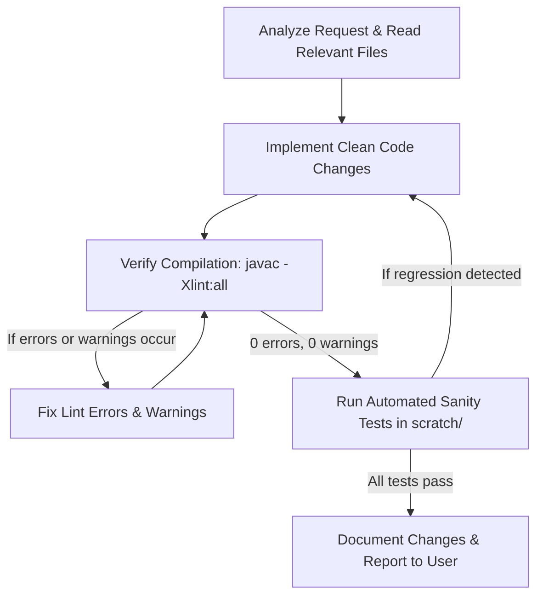

# Lumina's Regret - Antigravity Agent Guidelines (AGENTS.md)

Welcome to **Lumina's Regret**, a pure Java SE 2D Action-RPG engine inspired by classic 16-bit action-adventure games (The Legend of Zelda, Secret of Mana). This document serves as the **master operational guide** for AI coding agents (Antigravity) working within this codebase.

---

## 1. Project Identity & Architecture Tenets

| Attribute | Specification |
| :--- | :--- |
| **Language & Platform** | Pure Java SE 21 (JDK 21 LTS) |
| **External Dependencies** | **Strictly ZERO** (Only `java.desktop` / `java.base`) |
| **Display & Resolution** | 16x9 Tile Grid = **768 × 432 px** (Base Tile: 16×16 px scaled 3× to **48×48 px**) |
| **Target Frame Rate** | Deterministic Fixed Timestep at **60.0 FPS** (16.66 ms / tick) |
| **Graphics & Audio** | Java AWT / Swing `Graphics2D` (pixel-art retro aesthetics) + Java Sound API |
| **Compilation Standard** | Zero Errors and **Zero Warnings** under `javac -Xlint:all` |

### Non-Negotiable Core Tenets:
1. **Zero External Libraries**: Never introduce Maven, Gradle, Lombok, LWJGL, or third-party dependencies unless explicitly ordered by the user. Rely purely on the modern standard JDK.
2. **Deterministic Hot-Path Performance**: The 60 FPS game loop (`GamePanel.run()`) must never trigger memory thrashing. Alleviate GC pressure by eliminating unnecessary heap allocations in the update and render loops.
3. **Strict Compilation Cleanliness**: Every single modification must compile with `javac -Xlint:all` producing **0 errors and 0 warnings**. No unchecked warnings, deprecations, or unmanaged resources.
4. **Preserve Asset & Gameplay Integrity**: Never degrade existing quest progressions, combat feel, tile layouts, audio triggers, or UI aesthetics.

---

## 2. Directory & Package Structure

```
LuminasRegret/
├── .agents/skills/     # Custom skills & specialized engineering prompt guides
├── bin/                # Compiled .class binary output directory
├── res/                # Raw assets (sprites, tiles, sounds, fonts, maps)
│   ├── font/           # TTF fonts (fusion-pixel, Kingthings Petrock)
│   ├── maps/           # Plaintext 50x50 map data (worldV3.txt, dungeon01.txt)
│   ├── monster/        # Slime, Zombie, Goblin King sprites
│   ├── npc/            # Sylvia (Guide) & Boran (Merchant) 4-directional sprites
│   ├── objects/        # Keys, doors, chests, weapons, relics
│   ├── player/         # Player walking, attacking, and guarding sprites
│   ├── sound/          # WAV sound effects and BGM tracks
│   └── tiles/          # Overworld & dungeon tile textures
├── src/com/luminasregret/ # Standardized modular reverse-domain package tree
│   ├── engine/         # Low-level core engine subsystems
│   │   ├── ai/         # A* Pathfinding (Node.java, PathFinder.java)
│   │   ├── audio/      # Java Sound API (Sound.java, SoundPool)
│   │   ├── core/       # Entry point & master loop (Main.java, GamePanel.java, Config.java)
│   │   ├── gfx/        # Graphic pipeline & caching (UtilityTool.java)
│   │   ├── input/      # Unified I/O handling (KeyHandler.java, MouseHandler.java)
│   │   └── physics/    # Zero-GC AABB collision (CollisionChecker.java, CollisionMath.java)
│   ├── game/           # Game domain & gameplay mechanics
│   │   ├── entity/     # Dynamic actors (Actor.java, Entity.java, Player.java, NPCs, PlayerDummy)
│   │   │   └── contracts/ # Pure SOLID interfaces (Updatable, Renderable, Collidable, Interactable, Damageable)
│   │   ├── environment/# Day/night lighting cycle (EnvironmentManager.java, Lighting.java)
│   │   ├── monster/    # AI combat actors (MON_GoblinKing, MON_GreenSlime, MON_Zombie)
│   │   ├── object/     # Items & world props (WorldObject.java, Item.java interface, OBJ_* classes)
│   │   ├── quest/      # State-machine quest engine (QuestType.java, QuestManager.java)
│   │   ├── tile/       # Tile map rendering & collision (Tile.java, TileManager.java)
│   │   │   └── interactive/ # Destructible props (InteractiveTile.java, IT_DryTree.java, IT_Trunk.java)
│   │   └── world/      # World spawners & events (AssetSetter.java)
│   │       └── event/  # Event bus & cinematics (EventHandler.java, EventRect.java, CutsceneManager.java)
│   └── ui/             # Dynamic HUD & typography presentation (UI.java Facade)
│       └── renderer/   # Specialized UI sub-renderers (HudRenderer, BossHudRenderer, DialogueRenderer, MenuRenderer, InventoryRenderer)
├── docs/               # Technical architecture & engineering specifications
│   ├── Architecture.md # Core loop, rendering layers, AABB math
│   ├── Patterns.md     # Idiomatic patterns & Effective Java compliance
│   ├── Roadmap.md      # Development phases & milestones
│   ├── Run.md          # Execution guides & JVM options
│   ├── Testing.md      # Test harness catalog & execution procedures
│   └── report.md       # Full architecture audit report
└── AGENTS.md           # Master operational guide for AI agents
```

---

## 3. Core Engine Mechanics & Subsystems

### 3.1 Game Loop & Threading Architecture
- **AWT Event Dispatch Thread (EDT)**: Handles OS window events, keyboard presses (`KeyHandler`), and mouse events (`MouseHandler`).
- **Worker Thread (`gameThread`)**: Executes `GamePanel.run()` using a precise delta timer (`System.nanoTime()`), calculating physics updates via `update()` and drawing layers via `repaint()` / `paintComponent()`.
- **Thread Concurrency Rule**: Input states transferred from EDT to `gameThread` must avoid data races and visibility hazards. Ensure single-assignment debounce and atomic snapshotting.

### 3.2 State Machine (`gp.gameState`)
The engine operates across distinct lifecycle states defined in `GamePanel`:
- `titleState (0)`: Main start menu, load game, options.
- `playState (1)`: Active real-time gameplay, physics, monster AI, combat.
- `pauseState (2)`: Simulation frozen, pause overlay displayed.
- `dialogueState (3)`: Interactive dialogue window with dynamic word-wrapping.
- `characterState (4)`: Player inventory, stats, equipment management.
- `optionState (5)`: Settings menu (volume, fullscreen, control guide).
- `gameOverState (6)`: Player death overlay, retry / respawn.
- `transitionState (7)`: Map transfer fading and coordinate repositioning.
- `tradeState (8)`: Merchant store (Buy / Sell / Exit interface).
- `cutsceneState (10)`: Scripted narrative animations and camera focus.
- `gameClearState (11)`: Victory screen, epilogue narrative, final stats.

### 3.3 Spatial Coordinates & Collision
- **Screen Space**: $768 \times 432$ pixels ($16 \times 9$ tiles).
- **World Space**: $2400 \times 2400$ pixels ($50 \times 50$ tiles per map).
- **Camera Offset**: Centered on player (`player.screenX = screenWidth/2 - tileSize/2`).
- **Collision Checking**: Evaluated via pure AABB math in `CollisionMath.java` using primitive parameters (`int x, y, width, height`), avoiding `new Rectangle` allocations in the hot path.

### 3.4 Interaction System (Keyboard & Mouse)
- **Key `E` / `ENTER` / `SPACE`**: Initiates proximity interaction (NPC speech, opening chests, opening doors with keys).
- **Left Mouse Click**:
  - If clicking an interactable object/NPC: Character turns and triggers interaction.
  - If clicking empty space or monster: Character swings weapon towards mouse cursor.
  - UI Menus: Activates hovered buttons and dialogue progression.
- **Right Mouse Click**: Executes rapid dash escape in the direction of the cursor.

### 3.5 Quest Progression Pipeline (`src/quest/`)
Game narrative flows through `QuestManager`:
1. `TALK_TO_GUIDE`: Meet Sylvia in the starting village.
2. `GET_TOOLS`: Acquire the Axe (from Boran or western hidden chest) and Lantern.
3. `CLEAR_PATH`: Chop obstacle dry trees (`IT_DryTree`) and defeat portal guardian.
4. `EXPLORE_DUNGEON`: Enter Dark Dungeon (Map 1), collect wing keys, reach checkpoint.
5. `DEFEAT_BOSS`: Trigger locked boss cutscene and defeat Goblin King.
6. `RETURN_TO_GUIDE`: Collect dropped *Lumina's Relic* and return to village.
7. `GAME_COMPLETED`: Deliver relic to Sylvia, lift the curse, trigger Game Clear.

---

## 4. Coding Standards & Agent Best Practices

### 4.1 Effective Java & Clean Code Rules
1. **Item 6 (Avoid creating unnecessary objects)**: In any method called 60 times per second (`update()`, `draw()`, `checkCollision()`), NEVER instantiate temporary objects (`new Rectangle`, `new Point`, `new Random`). Use primitive variables or cached reusable holders.
2. **Item 9 (Prefer try-with-resources)**: All resource streams (`InputStream`, `AudioInputStream`) must use `try-with-resources` to guarantee immediate descriptor release.
3. **Item 14 (Comparable specification)**: When sorting or prioritizing (e.g. `ai.Node`), implement `Comparable<T>` with consistent tie-breaking.
4. **Item 15 & 16 (Encapsulate state)**: Minimize member accessibility. Do not expose public mutable fields across subsystems.
5. **Item 72 (Standard exceptions)**: Throw `IllegalArgumentException` or `IllegalStateException` rather than raw `RuntimeException`. Never swallow exceptions with empty `catch` blocks.

### 4.2 Dynamic UI & Text Rendering Rule
- Never render raw dialogue or item descriptions using unmeasured strings or naive `split("\n")`.
- Always wrap text using `UI.wrapDialogueText(text, maxWidth, fontMetrics)`.
- Enforce visual padding and ensure text never exceeds subwindow borders across all display modes.

---

## 5. Development & Verification Workflow

When executing any task as Antigravity, follow this rigorous cycle:



### Essential Commands
- **Clean Recompile**:
  ```powershell
  Remove-Item -Recurse -Force bin\* ; javac -Xlint:all -encoding UTF-8 -cp "res" -d bin (Get-ChildItem -Path src -Filter *.java -Recurse | ForEach-Object { $_.FullName })
  ```
- **Execute Headless Sanity Tests**:
  ```powershell
  java "-Djava.awt.headless=true" -cp "bin;res" scratch.QuestProgressionTest
  java -cp "bin;res" scratch.InteractionSystemSanityTest
  java -cp bin scratch.DialogueWrappingSanityTest
  ```
- **Launch Game**:
  ```powershell
  java -cp "bin;res" com.luminasregret.engine.core.Main
  ```
