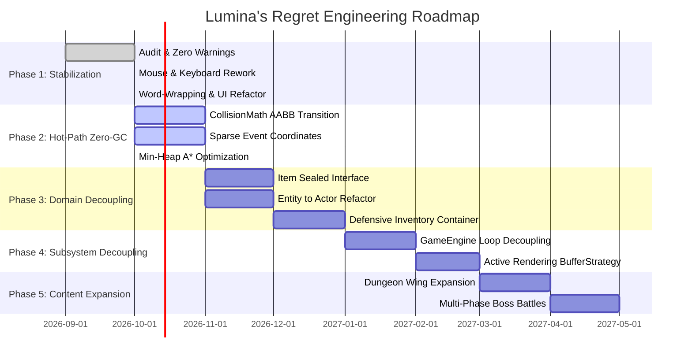

# Project Roadmap: Lumina's Regret

**Project Name**: Lumina's Regret  
**Architecture Horizon**: Pure Java SE 21 Action-RPG Engine  
**Release Cycle**: Phased Refactoring & Content Expansion  

---

## 1. Strategic Vision

The goal of the **Lumina's Regret** engineering roadmap is to elevate the codebase from a monolithic Java prototype into a benchmark retro-RPG engine. This includes:
1. Complete adherence to **Pure Java SE 21** standards without external dependencies.
2. Zero compiler warnings (`-Xlint:all` compliance).
3. Predictable 60 FPS performance via hot-path GC minimization.
4. An engaging, linear story arc featuring overworld exploration, dungeon crawling, boss encounters, and narrative closure.

---

## 2. Phased Milestone Blueprint



---

## 3. Milestone Details

### Phase 1: Stabilization & Zero-Warning Foundation (Status: COMPLETED ✅)
- [x] **Full Codebase Audit**: Completed comprehensive architectural inspection ([`report.md`](file:///c:/Users/HP/Rafi/MyProject/LuminasRegret/report.md)).
- [x] **Zero Compiler Warnings**: Eliminated all 68 warnings under `javac -Xlint:all` (added `serialVersionUID`, fixed `@SuppressWarnings`, resolved `this-escape` via static factory setup, marked non-overridden methods `final`).
- [x] **Stream & Audio Leak Remediation**: Implemented `try-with-resources` for `ImageIO`, font loading, and `AudioInputStream`.
- [x] **Interaction System Overhaul**:
  - Implemented `MouseHandler.java` for left-click interactions, directional sword swings, right-click dashes, and UI selection.
  - Implemented proximity observer in `Player.java` with Euclidean radius and facing-direction bias.
  - Implemented single-assignment debounce preventing dialogue auto-skipping.
- [x] **Dynamic Word-Wrapping Engine**:
  - Implemented `wrapDialogueText()` in `UI.java` with `FontMetrics` string measurement.
  - Redesigned dialogue subwindow geometry (672 px standard, 504 px trade mode) and inventory description subwindow.
  - Verified 100% boundary containment for all NPC lines and item descriptions.
- [x] **Quest Progression System**:
  - Implemented `QuestType` and `QuestManager`.
  - Linked world gates (Axe, Lantern, Dry Trees, Dungeon Portal, Boss Door, Relic drop, Game Clear screen).

---

### Phase 2: Hot-Path Zero-GC Optimization (Status: IN PROGRESS 🔄)
- [x] **Primitive Collision Math**: Integrated `CollisionMath.java` using pure primitive integer parameters.
- [x] **Min-Heap A* Pathfinding**: Refactored `PathFinder` and `Node` using `PriorityQueue<Node>` with `Comparable<Node>`.
- [ ] **Complete CollisionChecker Migration**:
  - Fully replace legacy `Rectangle.intersects()` calls across monster-monster and monster-player collision checks with `CollisionMath.intersects()`.
- [ ] **Sparse Event Coordinate Mapping**:
  - Replace cubic `EventRect[10][50][50]` array (25,000 objects in heap) in `EventHandler.java` with a sparse coordinate map `Map<Long, EventTrigger>`.
- [ ] **Pre-computed 1D Solid Grid**:
  - Cache map collision flags in a flat `boolean[]` array ($x + y \times \text{width}$) for optimal CPU L1/L2 cache locality during pathfinding.

---

### Phase 3: Domain & Object Model Decoupling (Status: PLANNED 📋)
- [ ] **Sealed Item Hierarchy**:
  - Extract items from `Entity` into a modern Java 21 sealed hierarchy:
    ```java
    public sealed interface Item permits Weapon, Shield, Consumable, QuestItem {}
    ```
- [ ] **Entity Decomposition**:
  - Decompose the 965-LOC `Entity` class into `Actor` (dynamic entities) and `WorldProp` (static entities).
  - Extract `CombatStats` and `MovementStrategy` components.
- [ ] **Encapsulated Inventory**:
  - Refactor `Player.inventory` to return `Collections.unmodifiableList()` and use defensive copies.

---

### Phase 4: Subsystem Decoupling & Active Rendering (Status: FUTURE 🚀)
- [ ] **GameLoop Decoupling**:
  - Extract the simulation thread from `GamePanel` into an independent `GameEngine` class.
- [ ] **Active Rendering via BufferStrategy**:
  - Migrate from Swing's passive `JPanel.paintComponent()` to a dedicated `java.awt.Canvas` with hardware double/triple `BufferStrategy`.
- [ ] **Audio Mixer Pool**:
  - Implement a dedicated pool of reusable audio channels to prevent system-level clip exhaustion.

---

### Phase 5: Gameplay & Content Expansion (Status: FUTURE 🎮)
- [ ] **Multi-Wing Dungeon Puzzles**:
  - Pressure plates, rolling boulders, and switch-activated gate shortcuts in Map 1.
- [ ] **Multi-Phase Boss Encounter**:
  - Phase 1: Melee cleaves and minion summoning.
  - Phase 2: Enrage state with projectile barrages and shockwave stomps.
- [ ] **New Game+ & Speedrun Timer**:
  - Retain character level, increase monster stats, and display completion time on the victory screen.

---

## 4. Technical Debt & Risk Management Matrix

| Risk / Debt | Impact | Probability | Mitigation Strategy |
| :--- | :--- | :--- | :--- |
| **Breaking Existing Tile Coordinates** | High | Low | Lock map coordinate constants in regression tests before refactoring `AssetSetter`. |
| **Input Latency under High Load** | High | Low | Enforce strict JMM-compliant snapshot polling at the start of each simulation tick. |
| **Audio Line Starvation on Windows** | Medium | Medium | Limit active concurrent sound effects to 16 lines with oldest-first eviction. |
| **Font Rendering Drift across OSes** | Low | Low | Package TTF fonts directly in `res/font/` and load via `Font.createFont()`. |
