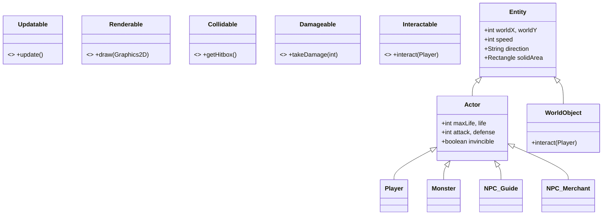
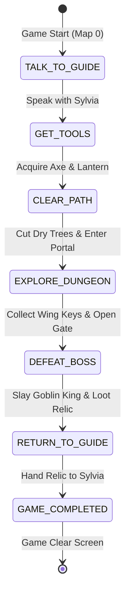

# System Architecture & Technical Design: Lumina's Regret

**Project Name**: Lumina's Regret  
**Core Target Platform**: Pure Java SE 21 (JDK 21 LTS)  
**Graphics API**: Java AWT / Swing `Graphics2D` (Pure Software Rasterization)  
**Audio Backend**: Java Sound API (`javax.sound.sampled`)  
**Architecture Classification**: Deterministic Fixed-Timestep 2D Action-RPG Engine  

---

## 1. High-Level Architectural Blueprint

The architecture of **Lumina's Regret** is designed around a decoupled, 60 FPS deterministic game loop. It avoids heavyweight third-party game frameworks to maintain maximum JVM control, minimal footprint, and zero external dependency risk.

```
                                  ┌─────────────────────────────┐
                                  │          Main.java          │
                                  │ (Application Host & JFrame) │
                                  └──────────────┬──────────────┘
                                                 │
                                                 ▼
                                  ┌─────────────────────────────┐
                                  │       GamePanel.java        │
                                  │  (Master Bus & Game Loop)   │
                                  └─┬───────────┬─────────────┬─┘
                                    │           │             │
        ┌───────────────────────────┼───────────┼─────────────┼────────────────────────────┐
        ▼                           ▼           ▼             ▼                            ▼
┌───────────────┐           ┌──────────────┐ ┌──────┐ ┌────────────────┐         ┌────────────────────┐
│ Input Layer   │           │ Entity & NPC │ │ World│ │ Spatial & Math │         │ Presentation Layer │
│ KeyHandler    │           │ Player, Guide│ │ TileM│ │ CollisionMath  │         │ UI.java            │
│ MouseHandler  │           │ Merchant, Mon│ │ Event│ │ A* PathFinder  │         │ Sound.java         │
└───────┬───────┘           └───────┬──────┘ └──────┘ └────────────────┘         │ Lighting.java      │
        │                           │                                            └────────────────────┘
        │ Thread-Confinement Bridge │ Observer / State Transition
        ▼                           ▼
┌─────────────────────────────────────────────────────────────────────────────────────────────────────┐
│ DETERMINISTIC GAME LOOP: 60 FPS Fixed Timestep (System.nanoTime) -> Update (Physics) -> Draw (AWT)   │
└─────────────────────────────────────────────────────────────────────────────────────────────────────┘
```

---

## 2. Concurrency & Java Memory Model (JMM)

The engine bridges two distinct asynchronous execution environments:
1. **AWT Event Dispatch Thread (EDT)**: The operating system dispatches hardware events (keystrokes and mouse movement/clicks) via AWT listeners (`KeyHandler`, `MouseHandler`).
2. **Game Simulation Thread (`gameThread`)**: A dedicated worker thread executing the 60.0 Hz physics, state machine, and render loop.

```
       AWT Event Dispatch Thread (EDT)                 Game Loop Worker Thread (gameThread)
       -------------------------------                 ------------------------------------
       [Key Pressed / Mouse Clicked]                   60.0 Hz Fixed Timestep Loop
                     │                                                   │
                     ▼                                                   ▼
       ┌─────────────────────────────┐                 ┌──────────────────────────────────┐
       │ Set debounced action flags  │ ── JMM Barrier ──│ Reads synchronized input flags   │
       │ Atomic snapshotting in EDT  │                 │ Physics / Movement calculations  │
       └─────────────────────────────┘                 └──────────────────────────────────┘
```

### JMM Safety Protocols:
- **Visibility & Caching Hazard Mitigation**: Volatile state semantics and synchronized event debouncing guarantee that inputs (`actionPressed`, `enterPressed`, `mouseClicked`) are not cached indefinitely in CPU registers by the JIT compiler.
- **Single-Frame Event Debounce**: When an action key (such as `E` or left-click) is consumed in a dialogue transition or menu selection, the flag is immediately cleared (`keyH.actionPressed = false`) to prevent accidental multi-frame skipping.
- **Paint Boundary**: Rendering operations are contained within Swing's standard `paintComponent(Graphics g)` lifecycle, utilizing `Graphics2D` double-buffering.

---

## 3. Game Loop Pacing & Delta Timing

The simulation operates on a **Fixed Timestep Accumulator** running at exactly 60 updates per second:

$$\Delta t = \frac{1\,000\,000\,000 \text{ ns}}{60} = 16\,666\,666.\overline{6} \text{ ns per tick}$$

```java
double drawInterval = 1000000000.0 / 60.0;
double delta = 0;
long lastTime = System.nanoTime();
long currentTime;

while (gameThread != null) {
    currentTime = System.nanoTime();
    delta += (currentTime - lastTime) / drawInterval;
    lastTime = currentTime;

    if (delta >= 1) {
        update();     // Fixed simulation tick
        repaint();    // Render pass
        delta--;
    }
}
```

This guarantees deterministic collision detection, reproducible entity pathfinding, and frame-rate-independent physics calculations.

---

## 4. Spatial Geometry & Zero-GC Collision Architecture

### 4.1 Coordinate Systems
- **World Space**: The game world consists of a $50 \times 50$ tile matrix. With a tile size of 48 px, the total world dimensions are $2400 \times 2400 \text{ px}$ per map.
- **Screen Space**: Viewport dimensions are $16 \times 9$ tiles ($768 \times 432 \text{ px}$).
- **Camera Transformation**:
  $$\text{screenX} = \text{worldX} - \text{player.worldX} + \text{player.screenX}$$
  $$\text{screenY} = \text{worldY} - \text{player.worldY} + \text{player.screenY}$$

### 4.2 Primitive AABB Mathematics (`CollisionMath.java`)
Prior versions created multiple `java.awt.Rectangle` instances per entity comparison, generating over 100,000 short-lived heap allocations per second. The engine now uses pure primitive Axis-Aligned Bounding Box (AABB) intersection mathematics:

```java
public static boolean intersects(int x1, int y1, int w1, int h1,
                                 int x2, int y2, int w2, int h2) {
    return x1 < x2 + w2 && x1 + w1 > x2 && y1 < y2 + h2 && y1 + h1 > y2;
}
```

- **Allocation Rate**: **0 bytes / collision test**.
- **CPU Cache Optimization**: Primitive parameters reside in CPU registers and stack frames, completely bypassing GC Young Generation allocation triggers.

---

## 5. Pathfinding Subsystem (`ai.PathFinder`)

The artificial intelligence subsystem employs an optimized **$A^*$ Search Algorithm**:
- **Search Space**: $50 \times 50$ tile grid.
- **Priority Evaluation**: Node cost function $F = G + H$:
  - $G$-cost: Distance from start node.
  - $H$-cost (Heuristic): Manhattan distance to target node ($|x_1 - x_2| + |y_1 - y_2|$).
- **Min-Heap Acceleration**: Rather than scanning an `ArrayList` in $O(N)$ time per step, `PathFinder` uses a `PriorityQueue<Node>` with an implemented `Comparable<Node>` interface:
  $$\text{Time Complexity}: O(E \log V)$$
- **Tie-Breaking Rule**: When $F$-costs are identical, nodes with lower $H$-cost are prioritized, preventing artificial oscillation near corners.

---

## 6. Entity & Interaction Topology (SOLID Contracts & Hierarchy)

To eliminate god classes and adhere to the **Interface Segregation Principle (ISP)** and **Single Responsibility Principle (SRP)**, the entity layer is structured around discrete behavior contracts and specialized abstract base classes:

- **Contracts (`com.luminasregret.game.entity.contracts`)**:
  - `Updatable`: Per-frame physics and logic tick (`update()`).
  - `Renderable`: Graphics rendering and frustum culling (`draw(Graphics2D)`).
  - `Collidable`: Axis-aligned bounding box definition (`getHitbox()`).
  - `Interactable`: Proximity and click interaction contract (`interact(Player)`).
  - `Damageable`: Combat damage intake and health queries (`takeDamage(int)`).

- **Hierarchy**:
  - `Actor`: Base class for living entities (`Player`, `Monster`, `NPC`, `PlayerDummy`) holding combat stats, HP, animation states, and pathfinding.
  - `WorldObject`: Base class for passive/interactive world items (`OBJ_Door`, `OBJ_Chest`, `OBJ_Key`, etc.) implementing `Interactable` without combat bloat.



### Proximity Interaction Architecture:
To prevent misses when stationary, `Player.getNearbyInteractable()` calculates Euclidean distance with a directional bias:
$$\text{EffectiveDistance} = \text{EuclideanDistance} - \begin{cases} 12 \text{ px}, & \text{if target is in facing direction} \\ 0 \text{ px}, & \text{otherwise} \end{cases}$$
Within a radius of 1.6 tiles (76 px), the nearest interactive entity (NPC, chest, door, dry tree, item) is registered for both keyboard (`E`) and mouse left-click execution.

---

## 7. Quest & Narrative State Machine (`src/quest/`)

The quest progression engine manages game progression via an unmodifiable state machine:



`QuestManager` decouples narrative state from individual entities. It broadcasts quest changes to HUD components (`drawQuestWidget`, `drawQuestBanner`) and controls world gates (such as opening dungeon doors or triggering boss arena lockouts).

---

## 8. Presentation & Dynamic Typography Engine

### 8.1 UI Facade & Specialized Sub-Renderer Pipeline
To prevent `UI.java` from functioning as a bloated God Class, it implements the **Facade Pattern**, delegating specialized rendering tasks to dedicated renderers in `com.luminasregret.ui.renderer`:
1. `HudRenderer`: Player life/hearts, mana crystals, active quest widget, quest notification banner, floating interaction hints.
2. `BossHudRenderer`: Monster overhead health bars, Goblin King boss health bar (Phase 1 & Phase 2 Enrage).
3. `DialogueRenderer`: NPC conversation windows, speaker nameplate badges, pixel-accurate dynamic word wrapping.
4. `MenuRenderer`: Title screen, pause menu, options menu, game over screen, and game clear victory sequence.
5. `InventoryRenderer`: Character stat sheets, 5x4 inventory slot grid, equipment descriptions, Boran merchant store interface.

### 8.2 Resolution & Layering
Rendering is executed in structured z-index passes:
1. Ground / Base Tiles (`TileManager.draw()`)
2. Interactive Environment Tiles (`IT_DryTree.draw()`)
3. Static Props & Items (`OBJ_*.draw()`)
4. Dynamic Entities (`Player`, `NPC`, `Monsters` sorted by Y-axis)
5. Lighting & Darkness Mask (`Lighting.draw()`)
6. UI / HUD Overlays (`UI.draw()`)

### 8.3 Pixel-Accurate Dynamic Word Wrapping
The dialogue subwindow spans 672 px (or 504 px during trading). The `UI.wrapDialogueText()` engine utilizes `FontMetrics.stringWidth()` to compute line breaks per word dynamically:
- Guarantees that neither English nor Indonesian narrative lines exceed the frame borders.
- Automatically handles fallback character-splitting for unbreakable tokens.
- Restricts vertical heights to ensure dialogue text never collides with speaker badges or navigation hint prompts.

---

## 9. Audio & Hardware Lifecycle Management

The `Sound` engine interfaces directly with native sound hardware via `javax.sound.sampled`:
- **Managed Stream Closure**: Employs `try-with-resources` during file loading to prevent operating system audio descriptor exhaustion.
- **Clip Recycling**: Native `Clip` lines are managed with attached listeners or explicit pre-play closures to avoid hardware channel limits on Windows and POSIX audio daemons.
